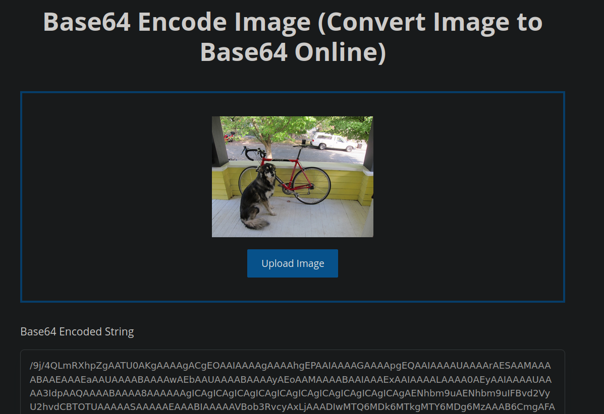
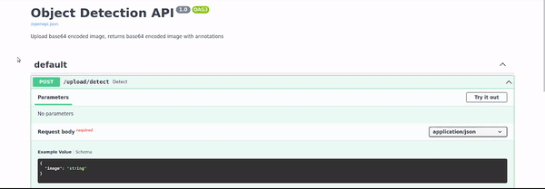
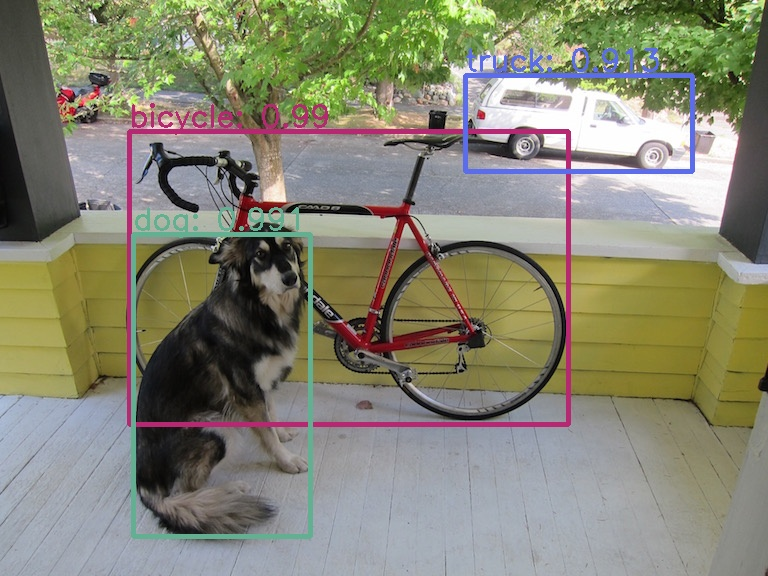

# Object Detector API

Check out a live demo [here](https://projects.object-detector.luiz.lat)!

API for object detection using YOLOSSD

## Running Locally

### * Using Docker image

1. Pull the image from dockerhub or build it yourself

* **Dockerhub**
    ```bash
    docker pull luisill0/obj-detector-api:latest
    ```

* **Build in the terminal**
    ```bash
    docker build --rm -t [repo]:[tag] .
    ```

2. Run the image
    ```bash
    docker run --rm -p 3100:3100 luisill0/obj-detector-api:latest
    ```


### * Running the python script

0. (Optional) Create a virtual environment

1. Install the requirements

    ```bash
    pip install -r requirements.txt
    ```

2. Start the api
    ```bash
    uvicorn api.app:app
    ```

3. Navigate to http://localhost:3100/docs in your browser to view the UI

\* You might need to install additional packages like `ffmpeg` depending on your machine

## How to use
Once you have the API running locally:

1. Encode an image in base64, you can find encoders online, for example: https://www.base64encoder.io/image-to-base64-converter/

    

2. Copy and paste the encoded string in the UI box:

    

    or make a POST request to the api with the encoded image:

    ```JavaScript```
    ```js
    const axios=require('axios');

    const encodedImage = [YOUR ENCODED IMAGE]
    axios({
        url: 'http://localhost:8000/upload/detect',
        method: 'post',
        data: {
            image: encodedImage
        }
    })
        .then(function (result) {
            console.log(result.data)
        })
    ```

3. The API will return the same image with the annotations, encoded in base64, you can find decoders online, for example: https://base64-to-image.com/
    
    

    When decoding the image, especially online, make sure to only decode the image source, for example:

    If the api response is:
    ```
    {
        "image": "data"image/jpeg;base64, /9j/4AAQSkZJRgABA...
    }
    ```

    Make sure to just copy everything after the first comma
    ```
    /9j/4AAQSkZJRgABA...
    ```
